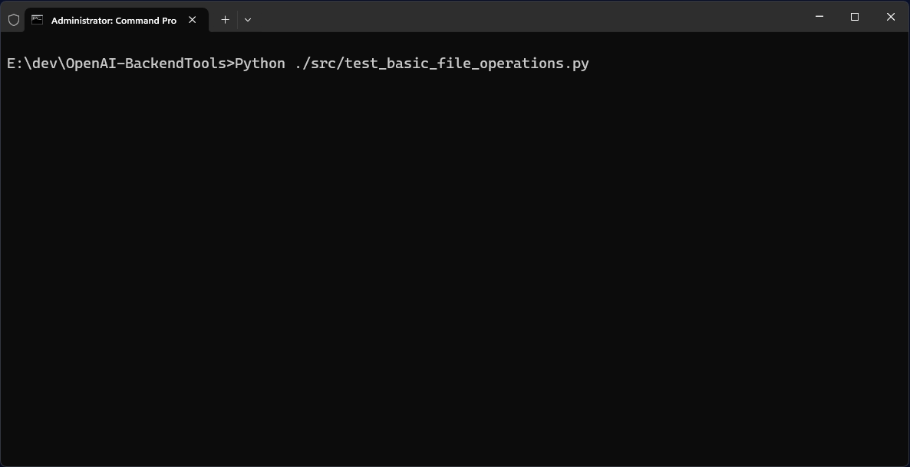

# OpenAI-BackendTools
A collection of tools and demo code to test, operate and maintain Open AI and Azure OpenAI backends. The toolkit is targeted at developers and operators who need to interact with Azure OpenAI services programmatically.

- **Authentication Management**: Support for multiple authentication methods including Service Principals, Managed Identities, and API Keys, all configured in `.env` file. Functions to test authentication: `test_access_with_api_key.py` and `test_access_with_service_principal.py`.
- **List and manage stored files** with `test_file_listings.py`: Functions for listing stored files with total storage and status (`processed`, `cancelled`, `frozen`, `in_progress`, `completed`) , vector stores (used and expired), assistants, and files NOT used in vector stores and assistants.
- **Cleanup** with `test_cleanup_operations.py`: Tools for deleting expired and unused files to save cost, delete expired vector stores and unneeded assistants.
- **RAG demos** with `test_rag_operations.py`: Code that demonstrates uploading files to vector stores with metadata extraction.
- **Vector Store Search**: Code that demonstrates vector store search, filtering and query rewrite.

#### 👉 How to set up your Azure Open AI Service to use this toolkit: [AzureOpenAI.md](AzureOpenAI.md)
- Creating your .env file and where to get the information from
- Example .env files for access via API keys, Managed Identity, and Service Principal
- Azure Open AI deployment and access types
- How to set up access roles for managed identities and service principals
- Terminology explained: What is a service principal, managed identity, tenant, client ID, client secret


#### Open AI Links

| Source                          | Links                                                        |                                                              |                                                              |                                                              |                                                              |
| ------------------------------- | ------------------------------------------------------------ | ------------------------------------------------------------ | ------------------------------------------------------------ | ------------------------------------------------------------ | ------------------------------------------------------------ |
| Open AI Docs                    | [Models](https://platform.openai.com/docs/models)            | [Pricing](https://platform.openai.com/docs/pricing)          | [Cookbook](https://cookbook.openai.com/)                     | [Assistants](https://platform.openai.com/docs/assistants/overview) | [Agents](https://platform.openai.com/docs/guides/agents)     |
| Open AI Docs                    | [Built-In tools](https://platform.openai.com/docs/guides/agents) | [Evals](https://platform.openai.com/docs/guides/evals)       | [Fine-tuning](https://platform.openai.com/docs/guides/fine-tuning) | [Retrieval / Search](https://platform.openai.com/docs/guides/retrieval) | [Actions](https://platform.openai.com/docs/actions/introduction) |
| Open AI Docs                    | [Data retention](https://platform.openai.com/docs/guides/your-data) | [Using PDF files](https://platform.openai.com/docs/guides/pdf-files) |                                                              |                                                              |                                                              |
| Open AI Docs - File search tool | [File search tool](https://platform.openai.com/docs/guides/tools-file-search) | [Retrieval customization](https://platform.openai.com/docs/guides/tools-file-search#retrieval-customization) | [Metadata filtering](https://platform.openai.com/docs/guides/tools-file-search#metadata-filtering) | [Supported files](https://platform.openai.com/docs/guides/tools-file-search#supported-files) |                                                              |
| Open AI API                     | [Responses](https://platform.openai.com/docs/api-reference/responses) | [Completions](https://platform.openai.com/docs/api-reference/chat) | [Files](https://platform.openai.com/docs/api-reference/files) | [Vector stores](https://platform.openai.com/docs/api-reference/vector-stores) | [Assistants](https://platform.openai.com/docs/api-reference/assistants) |
| Open AI Python                  | [OpenAI Agents SDK](https://openai.github.io/openai-agents-python/) |                                                              |                                                              |                                                              |                                                              |

#### Demo



#### Requirements / Packages

- azure-identity 1.23.0 ([releases](https://pypi.org/project/azure-identity/))
- requests 2.32.3 ([releases](https://pypi.org/project/requests/))
- python-dotenv 1.1.0 ([releases](https://pypi.org/project/python-dotenv/))
- openai 1.79.0 ([releases](https://pypi.org/project/openai/))

### Project structure

```
├── src/
│   ├── openai_backendtools.py                 # Main library implementation with core functionality
│   ├── test_access_with_api_key.py            # Tests Azure OpenAI access using API key authentication
│   ├── test_access_with_service_principal.py  # Tests Azure OpenAI access using service principal
│   ├── test_basic_file_operations.py          # Basic file operations: upload, add to vector  store, deletion
│   ├── test_cleanup_operations.py             # Cleanup of files and vector stores
│   ├── test_file_listings.py                  # Listing of assistants, vector stores, files, unused files, etc. 
│   ├── test_rag_operations.py                 # RAG (Retrieval Augmented Generation) tests
│   └── test_search_operations.py              # Search API tests
├── RAGFiles/                                  # Directory for RAG-related test files
├── .env                                       # Environment configuration for Azure and OpenAI
├── env-file-template.txt                      # Template for .env file (documented in AzureOpenAI.md)
├── requirements.txt                           # Python package dependencies
├── LICENSE                                    # Project license information
├── AzureOpenAI.md                             # Azure setup instructions
└── README.md                                  # Project documentation
```

### How to create the Open AI client

This is done as follows in all scripts:

```python
openai_service_type = os.getenv("OPENAI_SERVICE_TYPE", "openai")
azure_openai_use_key_authentication = os.getenv("AZURE_OPENAI_USE_KEY_AUTHENTICATION", "false").lower() in ['true']

if openai_service_type == "openai":
  client = create_openai_client()
elif openai_service_type == "azure_openai":
  client = create_azure_openai_client(azure_openai_use_key_authentication)
```

## File Operations

### Function: `list_all_files`

**Location:** `test_file_listings.py`

**Parameters:** 
- `client`: The OpenAI client instance to use for API calls

Lists all files in the storage as markdown table, showing total consumed storage at the top. Limits output to 50 rows because of Python console character limit.

**Example output:**
```
Total files: 180 using 780.60 MB (180 processed, 0 failed, 0 cancelled, 0 frozen, 0 in_progress, 0 completed). Showing first 25 and last 25 files.
------------------------------------------------------------------------------------------------------------------------------------------------
Index | ID                                 | Filename                                 | Size      | Created             | Status    | Purpose   
----- | ---------------------------------- | ---------------------------------------- | --------- | ------------------- | --------- | ----------
00000 | assistant-VLcmNN3SF7XNTQRZTz7SFG   | Publications1.md                         | 1.87 KB   | 2025-05-27 10:50:39 | processed | assistants
00001 | assistant-7dbdC1J2XTpE84cBEgFzwY   | Publications1.md                         | 1.87 KB   | 2025-05-26 19:36:26 | processed | assistants
...   | ...                                | ...                                      |           |                     | ...       | ...       
00178 | assistant-P1YNs2NMxx9hTc6pLsf33ssz | Example-file-1.pdf                       | 4.82 MB   | 2024-12-19 10:55:57 | processed | assistants
00179 | assistant-mLLOQ0Cdk82F3IHFFbw0aAHx | Example-file-with-very-long-name-that... | 1.44 MB   | 2024-12-19 10:55:47 | processed | assistants
```
### Function: `list_vector_stores`

**Location:** `test_file_listings.py`

**Parameters:** 
- `client`: The OpenAI client instance to use for API calls

Lists all vector stores in a table format, showing total count and number of expired stores at the top.

**Example output:**
```
Total vector stores: 3 (0 expired)
--------------------------------------------------------------------------------------------------------------------------------------------------------------------
Index | ID                          | Name                          | Created             | Status    | Size     | Files (completed, in_progress, failed, cancelled)
----- | --------------------------- | ----------------------------- | ------------------- | --------- | -------- | -------------------------------------------------
00000 | vs_590JuZn9rMPObfpUjZcTU9PS | vector-store-1                | 2025-03-06 11:08:02 | completed | 2.36 MB  | Total: 4 (✓ 4, ⌛ 0, ❌ 0, ⏹ 0)
00001 | vs_MBInFXZYATSGH7DwilCpe78p | vector-store-2                | 2025-03-03 11:12:12 | completed | 45.19 MB | Total: 35 (✓ 35, ⌛ 0, ❌ 0, ⏹ 0)
00002 | vs_yJOdYW0eJKwPDh47zzSrPTyN | wa-vectorstore-ecar-2023-eval | 2024-12-19 10:59:51 | completed | 41.97 MB | Total: 32 (✓ 32, ⌛ 0, ❌ 0, ⏹ 0)
```
### Function: `list_assistants`

**Location:** `test_file_listings.py`

**Parameters:** 
- `client`: The OpenAI client instance to use for API calls

Lists all assistants with their associated vector stores.

**Example output:**
```
Total assistants: 5
--------------------------------------------------------------------------------------------------------------------------------------------------
Index | ID                            | Name                                     | Model       | Created             | Vector Store
----- | ----------------------------- | ---------------------------------------- | ----------- | ------------------- | ---------------------------
0000  | asst_KlxUhvUWcZ1bhK1TXM1EeDXU | Annual Reports 2022                      | gpt-4o-mini | 2025-03-06 11:06:06 | vs_590JuZn9rMPObfpUjZcTU9PS
0001  | asst_7l1vkPnCE5sQpvMP2xmOKrWH | Annual Reports 2023                      | gpt-4o-mini | 2025-03-03 11:08:01 | vs_MBInFXZYATSGH7DwilCpe78p
0002  | asst_6tlbDUrWIopTQtDMZJv9zKPo | Annual Reports 2024                      | gpt-4o-mini | 2025-02-28 14:08:46 | vs_yJOdYW0eJKwPDh47zzSrPTyN
0003  | asst_48p6SzMcbhQRIg3e8qdCElio | Document Metadata Extractor              | gpt-4o-mini | 2025-02-24 15:01:30 |
0004  | asst_YdMYFQMEqs0pklCc9aKzzcnK | ECAR2023-Eval                            | gpt-4o-mini | 2024-12-19 17:04:49 | vs_yJOdYW0eJKwPDh47zzSrPTyN
```
### Function: `list_files_used_by_vector_stores`

**Location:** `test_file_listings.py`

**Parameters:** 
- `client`: The OpenAI client instance to use for API calls 
- `all_files`: Optional. List of all files. If not provided, will fetch files using the client. 
Lists all files that are currently used by any vector store. Shows file metrics in the top row.

**Example output:**
```
Total files in vector stores: 71 (0 processed, 0 failed, 0 cancelled, 0 frozen, 0 in_progress, 71 completed)
----------------------------------------------------------------------------------------------------------------------------------------
Index | ID                                 | Filename | Size | Created             | Status    | Purpose | Vector Store
----- | ---------------------------------- | -------- | ---- | ------------------- | --------- | ------- | -----------------------------
00000 | assistant-nRZsjbeim0wrRTFy1yi76ee0 | ...      |      | 2024-12-19 10:59:51 | completed | ...     | vector-store-1
00001 | assistant-xPWevvbUOtHjIgKaGjKvupLN | ...      |      | 2024-12-19 10:59:51 | completed | ...     | vector-store-1
...   | ...                                | ...      |      |                     | ...       | ...     |
00069 | assistant-Nx2tjSf9p5B9PynfmEZu9S   | ...      |      | 2025-03-03 11:12:12 | completed | ...     | vector-store-2
00070 | assistant-55XqW6W2X2oX4Xp8X2oX4Xp8 | ...      |      | 2025-02-28 14:08:46 | completed | ...     | vector-store-2
```
### Function: `list_files_not_used_by_vector_stores` 

**Location:** `test_file_listings.py`

**Parameters:** 
- `client`: The OpenAI client instance to use for API calls 
- `all_files`: Optional. List of all files. If not provided, will fetch files using the client. 

Lists all files that are not currently used by any vector store.

**Example output:**
```
Total files NOT used in vector stores: 4
--------------------------------------------------------------------------------------------------------------------------------------------------
Index | ID                                    | Filename                                 | Size      | Created             | Status    | Purpose
----- | ------------------------------------- | ---------------------------------------- | --------- | ------------------- | --------- | ---------
00096 | file-a25022b39f214e39aadf8dbee8825599 | 2025-02-06_Copilot-Eval-Input.jsonl      | 124.73 KB | 2025-05-21 11:24:24 | processed | fine-tune
00137 | file-3d8f50beb9924e33aa608b9eea8e85bb | 2025-02-03_CustomGPT-WebSearchOnly-In... | 158.34 KB | 2025-02-03 11:00:02 | processed | fine-tune
00138 | file-7a5268a1221540acb99b65c2eee8841a | 2025-01-15_CustomChatGPT-Eval-Input.j... | 131.93 KB | 2025-01-20 15:03:13 | processed | fine-tune
00147 | file-20acda926dd84315bebb2096d74b1cda | 2024-12-19-EvalTest.jsonl                | 522.00 B  | 2024-12-19 12:26:48 | processed | fine-tune
```

### Function: `list_files_used_by_assistants`

**Location:** `test_file_listings.py`

**Parameters:** 
- `client`: The OpenAI client instance to use for API calls

Lists all files that are currently used by any assistant through their vector stores. Shows file metrics in the top row.

**Example output:**
```
Total files used by assistants: 71 (0 processed, 0 failed, 0 cancelled, 0 frozen, 0 in_progress, 71 completed)
----------------------------------------------------------------------------------------------------------------------------------------
Index | ID                                 | Filename | Size | Created             | Status    | Purpose | Vector Store
----- | ---------------------------------- | -------- | ---- | ------------------- | --------- | ------- | -----------------------------
00000 | assistant-nRZsjbeim0wrRTFy1yi76ee0 | ...      |      | 2024-12-19 10:59:51 | completed | ...     | vector-store-1
00001 | assistant-xPWevvbUOtHjIgKaGjKvupLN | ...      |      | 2024-12-19 10:59:51 | completed | ...     | vector-store-1
...   | ...                                | ...      |      |                     | ...       | ...     |
00069 | assistant-Nx2tjSf9p5B9PynfmEZu9S   | ...      |      | 2025-03-03 11:12:12 | completed | ...     | vector-store-2
00070 | assistant-55XqW6W2X2oX4Xp8X2oX4Xp8 | ...      |      | 2025-02-28 14:08:46 | completed | ...     | vector-store-2
```

### Function: `list_files_not_used_by_assistants` 

**Location:** `test_file_listings.py`

**Parameters:** 
- `client`: The OpenAI client instance to use for API calls
- `files_used_by_vector_stores`: Optional. List of files used by vector stores. If not provided, will fetch the list using the client. 

Lists all files that are not currently used by any assistant. Shows file metrics in the top row.

**Example output:**
```
Total files NOT used by assistants: 180 (180 processed, 0 failed, 0 cancelled, 0 frozen, 0 in_progress, 0 completed)
Index | ID                                 | Filename                                 | Size      | Created             | Status    | Purpose
----- | ---------------------------------- | ---------------------------------------- | --------- | ------------------- | --------- | ----------
00000 | assistant-VLcmNN3SF7XNTQRZTz7SFG   | Publications1.md                         | 1.87 KB   | 2025-05-27 10:50:39 | processed | assistants
00001 | assistant-7dbdC1J2XTpE84cBEgFzwY   | Publications1.md                         | 1.87 KB   | 2025-05-26 19:36:26 | processed | assistants
...   | ...                                | ...                                      |           |                     | ...       | ...
00178 | assistant-P1YNs2NMxx9hTc6pLsf33ssz | Example-file-1.pdf                       | 4.82 MB   | 2024-12-19 10:55:57 | processed | assistants
00179 | assistant-mLLOQ0Cdk82F3IHFFbw0aAHx | Example-file-with-very-long-name-that... | 1.44 MB   | 2024-12-19 10:55:47 | processed | assistants
```

## Basic file operations

### Function: `test_basic_file_operations`

**Location:** `test_basic_file_operations.py`

**Parameters:** 
- `client`: The OpenAI client instance to use for API calls 
- `file_path`: The path to the file to upload

Performs basic file operations: upload, add to vector store, deletion.

**Example output:**
```
[2025-05-28 17:06:44] START: Basic file operations (upload, vector stores, delete)...
  Adding file 'Publications1.md' to vector store...
    OK.
  Removing file 'Publications1.md' from vector store...
    OK.
  Deleting vector store 'test_vector_store'...
    OK.
  Deleting file 'Publications1.md'...
    OK.
[2025-05-28 17:07:00] END: Basic file operations (upload, vector stores, delete) (16 secs).
```
## RAG operations

### Function: `create_test_vector_store_with_files`

**Location:** `test_rag_operations.py`

**Parameters:** 
- `client`: The OpenAI client instance to use for API calls 
- `vector_store_name`: The name of the vector store to create
- `folder_path`: The path to the folder containing the files to upload


