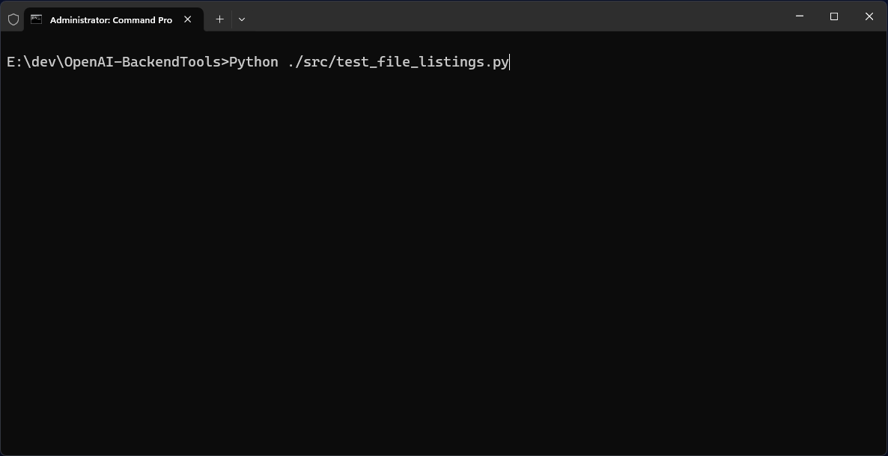

# OpenAI-BackendTools
A collection of tools and demo code to test, operate and maintain Open AI and Azure OpenAI backends. The toolkit is targeted at developers and operators who need to interact with Azure OpenAI and OpenAI backends programmatically. For example list files, assistants, vector stores, delete files, assistants, vector stores, upload files to vector stores, query vector stores, test search, etc.

#### Table of Contents
- [1. File listings](#1-file-listings) - files, assistants, vector stores
- [2. Basic file operations](#2-basic-file-operations) - upload file, add to vector store, deletion
- [3. RAG operations](#3-rag-operations) - create vector store, add files to vector store, query vector store
- [4. Search operations](#4-search-operations) - extract document metadata, search vector store, filter vector store, query rewrite
- [5. Cleanup operations](#5-cleanup-operations) - delete expired and unused files, delete expired vector stores and unneeded assistants
- [6. Vector store replication](#6-vector-store-replication) - replicate content between vector stores
- [7. Evaluation operations](#7-evaluation-operations) - evaluate RAG responses with scoring and grading

#### Files, Features, Demos
- **Authentication Management**: Support for multiple authentication methods including Service Principals, Managed Identities, and API Keys, all configured in `.env` file. Functions to test authentication: `test_access_with_api_key.py` and `test_access_with_service_principal.py`.
- **List and manage stored files** with `test_file_listings.py`: Functions for listing stored files with total storage and status (`processed`, `cancelled`, `frozen`, `in_progress`, `completed`) , vector stores (used and expired), assistants, and files NOT used in vector stores and assistants.
- **Cleanup** with `test_cleanup_operations.py`: Tools for deleting expired and unused files to save cost, delete expired vector stores and unneeded assistants.
- **RAG demos** with `test_rag_operations.py`: Code that demonstrates uploading files to vector stores with metadata extraction.
- **Vector Store Search**: Code that demonstrates vector store search, filtering and query rewrite.
- **Vector Store Replication** with `replicate_vector_store_content.py`: Tools for replicating files between vector stores.
- **Evaluation Operations** with `test_eval_operations.py`: Tools for evaluating RAG responses using judge models with scoring and grading.
- **File Crawling** with `test_file_crawling.py`: Data classes and utilities for file crawling operations.

#### 👉 How to set up your Azure Open AI Service to use this toolkit: [AzureOpenAI.md](AzureOpenAI.md)
- Creating your .env file and where to get the information from
- Example .env files for access via API keys, Managed Identity, and Service Principal
- Azure Open AI deployment and access types
- How to set up access roles for managed identities and service principals
- Terminology explained: What is a service principal, managed identity, tenant, client ID, client secret

#### Open AI Links

| Source                             | Links                                                        |                                                              |                                                              |                                                              |                                                              |
| ---------------------------------- | ------------------------------------------------------------ | ------------------------------------------------------------ | ------------------------------------------------------------ | ------------------------------------------------------------ | ------------------------------------------------------------ |
| Open AI Docs                       | [Models](https://platform.openai.com/docs/models)            | [Pricing](https://platform.openai.com/docs/pricing)          | [Cookbook](https://cookbook.openai.com/)                     | [Data retention](https://platform.openai.com/docs/guides/your-data) |                                                              |
| Open AI Docs                       | [Assistants](https://platform.openai.com/docs/assistants/overview) | [Agents](https://platform.openai.com/docs/guides/agents)     | [Using PDF files](https://platform.openai.com/docs/guides/pdf-files) |                                                              |                                                              |
| Open AI Docs                       | [Retrieval / Search](https://platform.openai.com/docs/guides/retrieval) | [Built-In tools](https://platform.openai.com/docs/guides/agents) | [Actions](https://platform.openai.com/docs/actions/introduction) |                                                              |                                                              |
| Open AI Docs                       | [Evals](https://platform.openai.com/docs/guides/evals)       | [Graders](https://platform.openai.com/docs/guides/graders)   | [Fine-tuning](https://platform.openai.com/docs/guides/fine-tuning) |                                                              |                                                              |
| Open AI Docs<br />File search tool | [File search tool](https://platform.openai.com/docs/guides/tools-file-search) | [Retrieval customization](https://platform.openai.com/docs/guides/tools-file-search#retrieval-customization) | [Metadata filtering](https://platform.openai.com/docs/guides/tools-file-search#metadata-filtering) | [Supported files](https://platform.openai.com/docs/guides/tools-file-search#supported-files) |                                                              |
| Open AI API                        | [Responses](https://platform.openai.com/docs/api-reference/responses) | [Completions](https://platform.openai.com/docs/api-reference/chat) | [Files](https://platform.openai.com/docs/api-reference/files) | [Vector stores](https://platform.openai.com/docs/api-reference/vector-stores) | [Assistants](https://platform.openai.com/docs/api-reference/assistants) |
| Open AI API                        | [Evals](https://platform.openai.com/docs/api-reference/evals) | [Graders](https://platform.openai.com/docs/api-reference/graders) |                                                              |                                                              |                                                              |
| Open AI Python                     | [REST API Docs](https://platform.openai.com/docs/api-reference/introduction) | [Python REST API GitHub](https://github.com/openai/openai-python) | [Python Agents SDK Docs](https://openai.github.io/openai-agents-python/) | [Python Agents SDK GitHub](https://github.com/openai/openai-agents-python) |                                                              |
| Open AI JS / TS                    | [REST API Docs](https://platform.openai.com/docs/api-reference/introduction) | [JS REST API GitHub](https://github.com/openai/openai-node)  | [JS Agents SDK Docs](https://openai.github.io/openai-agents-js/) | [JS Agents SDK GitHub](https://github.com/openai/openai-agents-js) |                                                              |

#### Requirements / Packages

- azure-identity 1.23.0 ([Package](https://pypi.org/project/azure-identity/))
- requests 2.32.3 ([Package](https://pypi.org/project/requests/))
- python-dotenv 1.1.0 ([Package](https://pypi.org/project/python-dotenv/))
- openai 1.79.0 ([Package](https://pypi.org/project/openai/))

#### Project structure

```
├── src/
│   ├── openai_backendtools.py                 # Main library implementation with core functionality
│   ├── test_access_with_api_key.py            # Tests Azure OpenAI access using API key authentication
│   ├── test_access_with_service_principal.py  # Tests Azure OpenAI access using service principal
│   ├── test_basic_file_operations.py          # Basic file operations: upload, add to vector  store, deletion
│   ├── test_cleanup_operations.py             # Cleanup of files and vector stores
│   ├── test_file_listings.py                  # Listing of assistants, vector stores, files, unused files, etc. 
│   ├── test_rag_operations.py                 # RAG (Retrieval Augmented Generation) tests
│   ├── test_search_operations.py              # Search API tests
│   ├── test_eval_operations.py                # Evaluation operations for RAG responses with scoring
│   ├── test_file_crawling.py                  # File crawling utilities and data classes
│   └── replicate_vector_store_content.py      # Vector store content replication tool
├── RAGFiles/                                  # Directory for RAG-related test files
├── .env                                       # Environment configuration for Azure and OpenAI
├── env-file-template.txt                      # Template for .env file (documented in AzureOpenAI.md)
├── requirements.txt                           # Python package dependencies
├── LICENSE                                    # Project license information
├── AzureOpenAI.md                             # Azure setup instructions
└── README.md                                  # Project documentation
```

#### .env File Template

```python
# Use OpenAI = 'openai', or Azure OpenAI = 'azure_openai'
OPENAI_SERVICE_TYPE=azure_openai

# Open AI backend settings
OPENAI_API_KEY=sk-svcacct-xxxxxxxxxxxxxxxx
OPEN_AI_ORGANIZATION=org-xxxxxxxxxxxxxxxxx

# Azure OpenAI key authentication. If 'false', then managed identity or service principal authentication will be used.
AZURE_OPENAI_USE_KEY_AUTHENTICATION=true
# Azure Open AI backend settings
AZURE_OPENAI_ENDPOINT=https://xxxxxxxxxxxxx.openai.azure.com/
AZURE_OPENAI_API_KEY=xxxxxxxxxxxxxxxxxxxxxx
AZURE_TENANT_ID=aaaaaaaa-aaaa-aaaa-aaaa-aaaaaaaaaaaa
AZURE_CLIENT_ID=bbbbbbbb-bbbb-bbbb-bbbb-bbbbbbbbbbbb
AZURE_CLIENT_SECRET=xxxxxxxxxxxxxxxxxxxxxx
AZURE_OPENAI_MODEL_DEPLOYMENT_NAME=gpt-4o-mini
AZURE_OPENAI_API_VERSION=2025-04-01-preview
```

#### How to create the Open AI client

This is done as follows in all scripts:

```python
openai_service_type = os.getenv("OPENAI_SERVICE_TYPE", "openai")
azure_openai_use_key_authentication = os.getenv("AZURE_OPENAI_USE_KEY_AUTHENTICATION", "false").lower() in ['true']

if openai_service_type == "openai":
  client = create_openai_client()
elif openai_service_type == "azure_openai":
  client = create_azure_openai_client(azure_openai_use_key_authentication)
```


## 1. File Listings



### Function: `list_all_files`

Lists all files in the storage as markdown table, showing total consumed storage at the top. Limits output to 50 rows because of Python console character limit.

**Location:** `test_file_listings.py`

**Parameters:** 
- `client`: The OpenAI client instance to use for API calls

**Example output:**
```
Total files: 180 using 780.60 MB (180 processed, 0 failed, 0 cancelled, 0 frozen, 0 in_progress, 0 completed). Showing first 25 and last 25 files.
------------------------------------------------------------------------------------------------------------------------------------------------
Index | ID                                 | Filename                                 | Size      | Created             | Status    | Purpose   
----- | ---------------------------------- | ---------------------------------------- | --------- | ------------------- | --------- | ----------
00000 | assistant-VLcmNN3SF7XNTQRZTz7SFG   | Publications1.md                         | 1.87 KB   | 2025-05-27 10:50:39 | processed | assistants
00001 | assistant-7dbdC1J2XTpE84cBEgFzwY   | Publications1.md                         | 1.87 KB   | 2025-05-26 19:36:26 | processed | assistants
...   | ...                                | ...                                      |           |                     | ...       | ...       
00178 | assistant-P1YNs2NMxx9hTc6pLsf33ssz | Example-file-1.pdf                       | 4.82 MB   | 2024-12-19 10:55:57 | processed | assistants
00179 | assistant-mLLOQ0Cdk82F3IHFFbw0aAHx | Example-file-with-very-long-name-that... | 1.44 MB   | 2024-12-19 10:55:47 | processed | assistants
```

**Open AI SDK code with pagination**
```
first_page = client.files.list()
has_more = hasattr(first_page, 'has_more') and first_page.has_more
...
while has_more:
  last_id = current_page.data[-1].id if current_page.data else None    
  next_page = client.files.list(after=last_id)
```

### Function: `list_vector_stores`

Lists all vector stores in a table format, showing total count and number of expired stores at the top.

**Location:** `test_file_listings.py`

**Parameters:** 
- `client`: The OpenAI client instance to use for API calls

**Example output:**
```
Total vector stores: 3 (0 expired)
--------------------------------------------------------------------------------------------------------------------------------------------------------------------
Index | ID                          | Name                          | Created             | Status    | Size     | Files (completed, in_progress, failed, cancelled)
----- | --------------------------- | ----------------------------- | ------------------- | --------- | -------- | -------------------------------------------------
00000 | vs_590JuZn9rMPObfpUjZcTU9PS | vector-store-1                | 2025-03-06 11:08:02 | completed | 2.36 MB  | Total: 4 (✓ 4, ⌛ 0, ❌ 0, ⏹ 0)
00001 | vs_MBInFXZYATSGH7DwilCpe78p | vector-store-2                | 2025-03-03 11:12:12 | completed | 45.19 MB | Total: 35 (✓ 35, ⌛ 0, ❌ 0, ⏹ 0)
00002 | vs_yJOdYW0eJKwPDh47zzSrPTyN | wa-vectorstore-ecar-2023-eval | 2024-12-19 10:59:51 | completed | 41.97 MB | Total: 32 (✓ 32, ⌛ 0, ❌ 0, ⏹ 0)
```

**Open AI SDK code with pagination**
```
first_page = client.vector_stores.list()
has_more = hasattr(first_page, 'has_more') and first_page.has_more
...
while has_more:
  last_id = current_page.data[-1].id if current_page.data else None
  next_page = client.vector_stores.list(after=last_id)
```

### Function: `list_assistants`

Lists all assistants with their associated vector stores.

**Location:** `test_file_listings.py`

**Parameters:** 
- `client`: The OpenAI client instance to use for API calls


**Example output:**
```
Total assistants: 5
--------------------------------------------------------------------------------------------------------------------------------------------------
Index | ID                            | Name                                     | Model       | Created             | Vector Store
----- | ----------------------------- | ---------------------------------------- | ----------- | ------------------- | ---------------------------
0000  | asst_KlxUhvUWcZ1bhK1TXM1EeDXU | Annual Reports 2022                      | gpt-4o-mini | 2025-03-06 11:06:06 | vs_590JuZn9rMPObfpUjZcTU9PS
0001  | asst_7l1vkPnCE5sQpvMP2xmOKrWH | Annual Reports 2023                      | gpt-4o-mini | 2025-03-03 11:08:01 | vs_MBInFXZYATSGH7DwilCpe78p
0002  | asst_6tlbDUrWIopTQtDMZJv9zKPo | Annual Reports 2024                      | gpt-4o-mini | 2025-02-28 14:08:46 | vs_yJOdYW0eJKwPDh47zzSrPTyN
0003  | asst_48p6SzMcbhQRIg3e8qdCElio | Document Metadata Extractor              | gpt-4o-mini | 2025-02-24 15:01:30 |
0004  | asst_YdMYFQMEqs0pklCc9aKzzcnK | ECAR2023-Eval                            | gpt-4o-mini | 2024-12-19 17:04:49 | vs_yJOdYW0eJKwPDh47zzSrPTyN
```

**Open AI SDK code with pagination**
```
first_page = client.beta.assistants.list()
has_more = hasattr(first_page, 'has_more') and first_page.has_more
...
while has_more:
  last_id = current_page.data[-1].id if current_page.data else None
  next_page = client.beta.assistants.list(after=last_id)
```

### Function: `list_files_used_by_vector_stores`

Lists all files that are currently used by any vector store. Shows file metrics in the top row.

**Location:** `test_file_listings.py`

**Parameters:** 
- `client`: The OpenAI client instance to use for API calls 
- `all_files`: Optional. List of all files. If not provided, will fetch files using the client.

**Example output:**
```
Total files in vector stores: 71 (0 processed, 0 failed, 0 cancelled, 0 frozen, 0 in_progress, 71 completed)
----------------------------------------------------------------------------------------------------------------------------------------
Index | ID                                 | Filename | Size | Created             | Status    | Purpose | Vector Store
----- | ---------------------------------- | -------- | ---- | ------------------- | --------- | ------- | -----------------------------
00000 | assistant-nRZsjbeim0wrRTFy1yi76ee0 | ...      |      | 2024-12-19 10:59:51 | completed | ...     | vector-store-1
00001 | assistant-xPWevvbUOtHjIgKaGjKvupLN | ...      |      | 2024-12-19 10:59:51 | completed | ...     | vector-store-1
...   | ...                                | ...      |      |                     | ...       | ...     |
00069 | assistant-Nx2tjSf9p5B9PynfmEZu9S   | ...      |      | 2025-03-03 11:12:12 | completed | ...     | vector-store-2
00070 | assistant-55XqW6W2X2oX4Xp8X2oX4Xp8 | ...      |      | 2025-02-28 14:08:46 | completed | ...     | vector-store-2
```

**Open AI SDK code**
```
files_page = client.vector_stores.files.list(vector_store_id=vector_store_id)
has_more = hasattr(files_page, 'has_more') and files_page.has_more
...
while has_more:
  last_id = current_page.data[-1].id if current_page.data else None
  next_page = client.vector_stores.files.list(vector_store_id=vector_store_id, after=last_id)
```

### Function: `list_files_not_used_by_vector_stores` 

Lists all files that are not currently used by any vector store.

**Location:** `test_file_listings.py`

**Parameters:** 
- `client`: The OpenAI client instance to use for API calls 
- `all_files`: Optional. List of all files. If not provided, will fetch files using the client. 

**Example output:**
```
Total files NOT used in vector stores: 4
--------------------------------------------------------------------------------------------------------------------------------------------------
Index | ID                                    | Filename                                 | Size      | Created             | Status    | Purpose
----- | ------------------------------------- | ---------------------------------------- | --------- | ------------------- | --------- | ---------
00096 | file-a25022b39f214e39aadf8dbee8825599 | 2025-02-06_Copilot-Eval-Input.jsonl      | 124.73 KB | 2025-05-21 11:24:24 | processed | fine-tune
00137 | file-3d8f50beb9924e33aa608b9eea8e85bb | 2025-02-03_CustomGPT-WebSearchOnly-In... | 158.34 KB | 2025-02-03 11:00:02 | processed | fine-tune
00138 | file-7a5268a1221540acb99b65c2eee8841a | 2025-01-15_CustomChatGPT-Eval-Input.j... | 131.93 KB | 2025-01-20 15:03:13 | processed | fine-tune
00147 | file-20acda926dd84315bebb2096d74b1cda | 2024-12-19-EvalTest.jsonl                | 522.00 B  | 2024-12-19 12:26:48 | processed | fine-tune
```

### Function: `list_files_used_by_assistants`

Lists all files that are currently used by any assistant through their vector stores. Shows file metrics in the top row.

**Location:** `test_file_listings.py`

**Parameters:** 
- `client`: The OpenAI client instance to use for API calls

**Example output:**
```
Total files used by assistants: 71 (0 processed, 0 failed, 0 cancelled, 0 frozen, 0 in_progress, 71 completed)
----------------------------------------------------------------------------------------------------------------------------------------
Index | ID                                 | Filename | Size | Created             | Status    | Purpose | Vector Store
----- | ---------------------------------- | -------- | ---- | ------------------- | --------- | ------- | -----------------------------
00000 | assistant-nRZsjbeim0wrRTFy1yi76ee0 | ...      |      | 2024-12-19 10:59:51 | completed | ...     | vector-store-1
00001 | assistant-xPWevvbUOtHjIgKaGjKvupLN | ...      |      | 2024-12-19 10:59:51 | completed | ...     | vector-store-1
...   | ...                                | ...      |      |                     | ...       | ...     |
00069 | assistant-Nx2tjSf9p5B9PynfmEZu9S   | ...      |      | 2025-03-03 11:12:12 | completed | ...     | vector-store-2
00070 | assistant-55XqW6W2X2oX4Xp8X2oX4Xp8 | ...      |      | 2025-02-28 14:08:46 | completed | ...     | vector-store-2
```

### Function: `list_files_not_used_by_assistants` 

Lists all files that are not currently used by any assistant. Shows file metrics in the top row.

**Location:** `test_file_listings.py`

**Parameters:** 
- `client`: The OpenAI client instance to use for API calls
- `files_used_by_vector_stores`: Optional. List of files used by vector stores. If not provided, will fetch the list using the client.

**Example output:**
```
Total files NOT used by assistants: 180 (180 processed, 0 failed, 0 cancelled, 0 frozen, 0 in_progress, 0 completed)
Index | ID                                 | Filename                                 | Size      | Created             | Status    | Purpose
----- | ---------------------------------- | ---------------------------------------- | --------- | ------------------- | --------- | ----------
00000 | assistant-VLcmNN3SF7XNTQRZTz7SFG   | Publications1.md                         | 1.87 KB   | 2025-05-27 10:50:39 | processed | assistants
00001 | assistant-7dbdC1J2XTpE84cBEgFzwY   | Publications1.md                         | 1.87 KB   | 2025-05-26 19:36:26 | processed | assistants
...   | ...                                | ...                                      |           |                     | ...       | ...
00178 | assistant-P1YNs2NMxx9hTc6pLsf33ssz | Example-file-1.pdf                       | 4.82 MB   | 2024-12-19 10:55:57 | processed | assistants
00179 | assistant-mLLOQ0Cdk82F3IHFFbw0aAHx | Example-file-with-very-long-name-that... | 1.44 MB   | 2024-12-19 10:55:47 | processed | assistants
```


## 2. Basic file operations


### Function: `test_basic_file_operations`

Performs basic file operations: upload, add to vector store, deletion. With Azure Open AI Services, if vector store and file deletion fails and you are using a Service Principal or Managed Identity, you need to assign it the 'Cognitive Services OpenAI Contributor' role. See [AzureOpenAI.md](AzureOpenAI.md) for more information.  

**Location:** `test_basic_file_operations.py`

**Parameters:** 
- `client`: The OpenAI client instance to use for API calls 
- `file_path`: The path to the file to upload

**Example output:**
```
[2025-05-28 17:06:44] START: Basic file operations (upload, vector stores, delete)...
  Adding file 'Publications1.md' to vector store...
    OK.
  Removing file 'Publications1.md' from vector store...
    OK.
  Deleting vector store 'test_vector_store'...
    OK.
  Deleting file 'Publications1.md'...
    OK.
[2025-05-28 17:07:00] END: Basic file operations (upload, vector stores, delete) (16 secs).
```

**Open AI SDK code**
```
with open(file_path, 'rb') as f:
  file = client.files.create(file=f, purpose="assistants")
...
vs = client.vector_stores.create(name=vs_name)
...
client.vector_stores.files.create(vector_store_id=vs.id, file_id=file.id)
...
client.vector_stores.files.delete(vector_store_id=vs.id, file_id=file.id)
...
client.vector_stores.delete(vs.id)
...
client.files.delete(file.id)
```


## 3. RAG operations


Functions and classes used to prepare test vector store and files:

- Function `create_test_vector_store_with_files` - Creates a vector store and uploads files from the specified folder to it. Handles retries and verifies file processing completion.
- Function `create_test_vector_store_from_folder_path` - Creates a vector store and uploads files from a folder path. Wrapper function that collects files and creates vector store.
- Function `collect_files_from_folder_path` - Recursively collects files from a folder path with metadata and file information.
- Function `build_test_vector_store_by_adding_collected_files` - Builds a vector store by adding collected files with retry logic and status verification.
- Function `extract_and_add_metadata_to_vector_store_using_responses_api` - Extracts metadata from files and re-adds files with more metadata to the vector store using the responses API. Handles retries and verifies file processing completion.
- Function `extract_and_add_metadata_to_vector_store_using_assistants_api` - Extracts metadata from files using the assistants API. Creates and deletes a temporary assistant to extract metadata.
- Class `TestVectorStoreWithFiles` - Container class that holds information about a test vector store and its associated files. Used to pass vector store and file information between test functions.

### Class: `TestVectorStoreWithFiles`

Container class that holds information about a test vector store and its associated files. Used to pass vector store and file information between test functions.

**Location:** `test_rag_operations.py`

**Fields:**
- `vector_store`: The vector store instance
- `files`: List of file paths that were uploaded
- `files_metadata`: Dictionary of metadata for each file (key=file_path) including source, filename, and file type
- `files_data`: Dictionary of additional file data (key=file_path) including file size, last modified date, and file ID

### Function: `create_test_vector_store_with_files`

Creates a vector store and uploads files from the specified folder to it. Handles retries and verifies file processing completion. Sets the following metadata for each file:
- `source`: The source path of the file
- `filename`: The filename of the file
- `file_type`: The file type of the file

**Location:** `test_rag_operations.py`

**Parameters:** 
- `client`: The OpenAI client instance to use for API calls
- `vector_store_name`: Name of the vector store to create
- `folder_path`: Path to folder containing files to upload

**Example output:**
```
[2025-06-09 12:39:37] START: Create test vector store with files...
  Creating vector store 'test_vector_store'...
    OK. ID=vs_6846b9ee0114819191d3197f66cf7ee1
  Uploading 2 files...
    [ 1 / 2 ] OK: Upload, OK: Add to vector store ID=file-NYFxgXFYqp2xTgYquTM4Z5 'E:\dev\OpenAI-BackendTools\RAGFiles\Batch01\ArilenaDrovikCV.pdf'
    [ 2 / 2 ] OK: Upload, OK: Add to vector store ID=file-TwCGYwub7ho7USKninPcEh 'E:\dev\OpenAI-BackendTools\RAGFiles\Batch01\Publications1.md'
  Verifying all vector store files are 'completed'...
    Waiting 10 seconds ( 1 / 10 ) for 1 files to complete...
[2025-06-09 12:39:55] END: Create test vector store with files (17 secs).
```

### Function: `create_test_vector_store_from_folder_path`

Creates a vector store and uploads files from a folder path. This is a wrapper function that combines file collection and vector store creation.

**Location:** `test_rag_operations.py`

**Parameters:** 
- `client`: The OpenAI client instance to use for API calls
- `vector_store_name`: Name of the vector store to create
- `folder_path`: Path to folder containing files to upload
- `include_subfolders`: Boolean. Whether to include files from subdirectories (default: True)
- `include_file_types`: List of file extensions to include (e.g., ["txt", "pdf"]) or ["*"] for all files (default: ["*"])

**Returns:**
- `TestVectorStoreWithFiles` object containing the vector store and file information

**Example output:**
```
[2025-06-09 12:39:37] START: Create test vector store from folder path...
[2025-06-09 12:39:55] END: Create test vector store from folder path (18 secs).
```

### Function: `collect_files_from_folder_path`

Recursively collects files from a folder path and returns file information with metadata.

**Location:** `test_rag_operations.py`

**Parameters:** 
- `folder_path`: Path to the folder to collect files from
- `include_subfolders`: Boolean. Whether to include files from subdirectories (default: True)
- `include_file_types`: List of file extensions to include (e.g., ["txt", "pdf"]) or ["*"] for all files (default: ["*"])

**Returns:**
- Tuple of `(files, files_metadata, files_data)` where:
  - `files`: List of file paths
  - `files_metadata`: Dictionary with metadata for each file (source, filename, file_type)
  - `files_data`: Dictionary with additional file data (file_size, last_modified)

**Example metadata:**
```python
files_metadata = {
  '/path/to/file.pdf': {
    'source': '/path/to/file.pdf',
    'filename': 'file.pdf',
    'file_type': 'pdf'
  }
}
files_data = {
  '/path/to/file.pdf': {
    'file_size': 1024000,
    'last_modified': '2025-06-09'
  }
}
```

### Function: `build_test_vector_store_by_adding_collected_files`

Builds a vector store by adding collected files with retry logic and status verification.

**Location:** `test_rag_operations.py`

**Parameters:** 
- `client`: The OpenAI client instance to use for API calls
- `vector_store`: The vector store object to add files to
- `files`: List of file paths to upload
- `files_metadata`: Dictionary of metadata for each file
- `files_data`: Dictionary of additional file data
- `log_headers`: Boolean. Whether to log function headers (default: True)

**Returns:**
- Updated `TestVectorStoreWithFiles` object

**Example output:**
```
[2025-06-09 12:40:00] START: Update test vector store from collected files...
  Uploading 2 files...
    [ 1 / 2 ] OK: Upload, OK: Add to vector store ID=file-abc123 'file1.pdf'
    [ 2 / 2 ] OK: Upload, OK: Add to vector store ID=file-def456 'file2.md'
  Verifying all vector store files are 'completed'...
[2025-06-09 12:40:15] END: Update test vector store from collected files (15 secs).
```

### Function: `test_rag_operations_using_responses_api`

Tests RAG operations by querying a vector store using the responses API, with and without file search results included.
**Location:** `test_rag_operations.py`

**Parameters:** 
- `client`: The OpenAI client instance to use for API calls
- `test_vector_store_with_files`: Instance of TestVectorStoreWithFiles containing vector store and file information
- `openai_model_name`: Name of the OpenAI model to use (in Azure Open AI it's the model deployment name)
- `query`: The query to test RAG operations with

**Example output:**
```
[2025-06-09 12:39:55] START: RAG operations using responses API...
--------------------------------------------------------------------------------------------------------------------------------------------
  Test query with 'file_search' tool: Who is Arilena Drovik?
    Response: Arilena Drovik is a highly accomplished molecular biologist and geneticist with ...
    status='completed', tool_choice='auto', input_tokens=3168, output_tokens=163
    File search tool call status: 'completed', results: N/A
  Test query with 'file_search' tool with 'file_search_call.results': Who is Arilena Drovik?
    Response: Arilena Drovik is a highly accomplished molecular biologist and geneticist with ...
    status='completed', tool_choice='auto', input_tokens=3168, output_tokens=163
    File search tool call status: 'completed', results: 2
    Index | File ID                     | Filename            | Score | Attributes | Content
    ----- | --------------------------- | ------------------- | ----- | ---------- | ------------------------------------------------------------
    00000 | file-NYFxgXFYqp2xTgYquTM4Z5 | ArilenaDrovikCV.pdf | 0.92  | 0 of 0     | (anonymous)  Arilena Drovik PhD Molecular Biology Princip...
    00001 | file-TwCGYwub7ho7USKninPcEh | Publications1.md    | 0.66  | 0 of 0     | | Title | Author(s) | Year | Publisher | Link | |-------|...
[2025-06-09 12:40:05] END: RAG operations using responses API (10 secs).
```

**Open AI SDK code**
```
# Query with response model that searches in vector store
response = client.responses.create(
    model=openai_model_name
    ,input=query
    ,tools=[{ "type": "file_search", "vector_store_ids": [vector_store_id] }]
    ,temperature=0
)
...
# Query with response model that searches in vector store and returns file search results
response = client.responses.create(
    model=openai_model_name
    ,input=query
    ,tools=[{ "type": "file_search", "vector_store_ids": [vector_store_id] }]
    ,include=["file_search_call.results"]
    ,temperature=0
)
response_file_search_tool_call = next((item for item in response.output if item.type == 'file_search_call'), None)
response_file_search_results = response_file_search_tool_call.results
```


## 4. Search operations


Functions and classes used to demonstrate vector store search, filtering, and query rewrite:
- Function `test_file_search_functionalities` - Demonstrates file search functionalities including basic search, filtered search, and query rewriting using a vector store.
Functions and classes used to prepare test vector store and files:
- Function `create_test_vector_store_with_files` - Creates a vector store and uploads files from the specified folder to it. Handles retries and verifies file processing completion.
- Function `extract_and_add_metadata_to_vector_store_using_responses_api` - Extracts metadata from files and re-adds files with more metadata to the vector store using the responses API. Handles retries and verifies file processing completion.
- Function `extract_and_add_metadata_to_vector_store_using_assistants_api` - Extracts metadata from files using the assistants API. Creates and deletes a temporary assistant to extract metadata.
- Class `TestVectorStoreWithFiles` - Container class that holds information about a test vector store and its associated files. Used to pass vector store and file information between test functions.
- Class `SearchParams` - Container class for search parameters used in test functions, such as vector store name, folder path, queries, and filters.

### Class: `SearchParams`

Container class for search parameters used in file search tests.

**Location:** `test_search_operations.py`

**Fields:**
- `vector_store_name`: Name of the vector store to use
- `folder_path`: Path to folder containing files to upload/search
- `search_query_1`: Basic search query
- `search_query_2`: Filtered search query
- `search_query_2_filters`: Dictionary of filters for search (e.g., `{ "key": "file_type", "type": "eq", "value": "md" }`)
- `search_query_3_with_query_rewrite`: Query to test search with query rewriting

### Function: `test_file_search_functionalities`

Demonstrates file search functionalities by performing:
- Basic search in a vector store
- Filtered search using metadata filters
- Search with query rewriting

**Location:** `test_search_operations.py`

**Parameters:**
- `client`: The OpenAI client instance to use for API calls
- `vector_store_id`: ID of the vector store to search
- `params`: Instance of `SearchParams` containing search queries and filters

**Example output:**
```
[2025-06-09 16:58:47] START: File search functionalities (RAG search, filter, rewrite query)...
  Testing query search (score_threshold=0.3, max_num_results=10): Who is Arilena Drovik?
    2 search results
    Index | File ID                     | Filename            | Score | Attributes | Content
    ----- | --------------------------- | ------------------- | ----- | ---------- | ------------------------------------------------------------
    00000 | file-EQPc9biqQ1WPMVGVEz15wK | ArilenaDrovikCV.pdf | 0.90  | 3 of 3     | (anonymous)  Arilena Drovik PhD Molecular Biology Princip...
    00001 | file-3hwPtVZzFg3a472r7UdfGd | Publications1.md    | 0.64  | 3 of 3     | | Title | Author(s) | Year | Publisher | Link | |-------|...
  --------------------------------------------------------------------------------------------------------------------------------------------
  Testing filtered query search (filter: file_type='md', score_threshold=0.3, max_num_results=10): Who is Arilena Drovik?
    1 search results
    Index | File ID                     | Filename         | Score | Attributes | Content
    ----- | --------------------------- | ---------------- | ----- | ---------- | ------------------------------------------------------------
    00000 | file-3hwPtVZzFg3a472r7UdfGd | Publications1.md | 0.64  | 3 of 3     | | Title | Author(s) | Year | Publisher | Link | |-------|...
  --------------------------------------------------------------------------------------------------------------------------------------------
  Testing rewrite query search (score_threshold=0.3, max_num_results=10): All files from year 2015.
    1 search results
    Rewritten query: Files from 2015
    Index | File ID                     | Filename         | Score | Attributes | Content
    ----- | --------------------------- | ---------------- | ----- | ---------- | ------------------------------------------------------------
    00000 | file-3hwPtVZzFg3a472r7UdfGd | Publications1.md | 0.64  | 3 of 3     | | Title | Author(s) | Year | Publisher | Link | |-------|...
[2025-06-09 16:59:03] END: File search functionalities (RAG search, filter, rewrite query) (16 secs).
```

**Links**
- [Search files in vector stores - Open AI API Reference](https://platform.openai.com/docs/api-reference/vector-stores/search)
- [Metadata filtering - Open AI Docs](https://platform.openai.com/docs/guides/tools-file-search#metadata-filtering)
- [Query rewriting - Open AI Docs](https://platform.openai.com/docs/guides/retrieval#query-rewriting)

**Open AI SDK code**
```
# Basic search: finds files that contain relevant content to answer a query
# https://platform.openai.com/docs/api-reference/vector-stores/search
client.vector_stores.search(
    vector_store_id=vector_store_id,
    query=query,
    ranking_options={"ranker": "auto", "score_threshold": 0.3},
    max_num_results=10
)

# Filtered search: finds files that contain relevant content but filtered by metadata
# https://platform.openai.com/docs/guides/tools-file-search#metadata-filtering
search_results = client.vector_stores.search(
  vector_store_id=vector_store_id,
  query=params.search_query_2,
  ranking_options={"ranker": "auto", "score_threshold": 0.3},
  max_num_results=10,
  filters={"key": "file_type", "type": "eq", "value": "md"}
)

# Search with query rewriting: finds files that contain relevant content to answer a query but rewritten by the model
# https://platform.openai.com/docs/guides/retrieval#query-rewriting
search_results = client.vector_stores.search(
  vector_store_id=vector_store_id,
  query=params.search_query_3_with_query_rewrite,
  rewrite_query=True,
  ranking_options={"ranker": "auto", "score_threshold": 0.3},
  max_num_results=10
)
rewritten_search_query = search_results.model_extra['search_query'][0]
```

### Function: `extract_and_add_metadata_to_vector_store_using_responses_api`

Extracts metadata ´(language, author, etc.) from files in a vector store using the responses API. Extracted metadata depends on the used prompt template. When adding the metadata, files are temporarely removed from the vector store and re-added with the extracted metadata since updating metadata ( `àttributes`) in the vector store is not supported as of 2025-06-09.

**Example metadata:**
```
{
  "title": "Arilena Drovik Curriculum Vitae",
  "description": "A comprehensive curriculum vitae of Arilena Drovik, detailing her academic and professional accomplishments in molecular biology and genetics.",
  "doc_type": "Curriculum vitae",
  "doc_language": "English",
  "doc_author": "Arilena Drovik",
  "doc_year": "2025",
  "doc_start_date": "",
  "doc_end_date": "2025-05-15"
}
```

This metadata is added to the existing metadata of the files in the vector store.

**Location:** `test_search_operations.py`

**Parameters:** 
- `client`: The OpenAI client instance to use for API calls
- `test_vector_store_with_files`: Instance of TestVectorStoreWithFiles containing vector store and file information
- `metadata_extraction_prompt_template`: Template for metadata extraction prompt
- `openai_model_name`: Name of the OpenAI model to use
- `logExtractedMetadata`: Optional boolean to control logging of extracted metadata

**Example metadata formatted as table:**
```
Index | file_type | doc_end_date | source | filename            | doc_type | title | doc_language | doc_start_date | doc_author | description | doc_year
----- | --------- | ------------ | ------ | ------------------- | -------- | ----- | ------------ | -------------- | ---------- | ----------- | --------
00000 | md        | 2025-05-15   | E:\... | Publications1.md    | Resea... | CR... | English      |                | Arilena... | A compil... | 2020
00001 | pdf       | 2025-05-15   | E:\... | ArilenaDrovikCV.pdf | Curri... | Ar... | English      |                | Arilena... | A compre... | 2025
```

**Open AI SDK code**
```python
client.responses.create(
  model=openai_model_name
  ,input=prompt
  ,tools=[
    {
      "type": "file_search"
      ,"vector_store_ids": [temp_vector_store.id]
      ,"max_num_results": 50
    }
  ]
)
extracted_metadata_string = response.output_text
# remove ```json and ```
extracted_metadata_string = extracted_metadata_string.replace("```json", "").replace("```", "")
extracted_metadata = json.loads(extracted_metadata_string)
```

### Function: `extract_and_add_metadata_to_vector_store_using_assistants_api`

Extracts metadata from files in a vector store using the assistants API. Creates a temporary assistant and vector store to process one file at a time. After metadata extraction, re-adds the files with the extracted metadata back to the original vector store. The Assistants API is from 2024 and subject to deprecation.

**Location:** `test_search_operations.py`

**Parameters:** 
- `client`: The OpenAI client instance to use for API calls
- `test_vector_store_with_files`: Instance of TestVectorStoreWithFiles containing vector store and file information
- `metadata_extraction_prompt_template`: Template for metadata extraction prompt
- `openai_model_name`: Name of the OpenAI model to use
- `logExtractedMetadata`: Optional boolean to control logging of extracted metadata

**Example metadata formatted as table:**
```
Index | file_type | doc_end_date | source | filename            | doc_type | title | doc_language | doc_start_date | doc_author | description | doc_year
----- | --------- | ------------ | ------ | ------------------- | -------- | ----- | ------------ | -------------- | ---------- | ----------- | --------
00000 | md        | 2025-05-15   | E:\... | Publications1.md    | Resea... | CR... | English      |                | Arilena... | A compil... | 2020
00001 | pdf       | 2025-05-15   | E:\... | ArilenaDrovikCV.pdf | Curri... | Ar... | English      |                | Arilena... | A compre... | 2025
```

**Open AI SDK code**
```python
# Create assistant for metadata extraction
assistant = client.beta.assistants.create(
  name="test_assistant"
  ,instructions="You are a metadata extraction assistant, returning extracted tags from documents as JSON."
  ,model=openai_model_name
  ,tools=[{"type": "file_search"}]
  ,tool_resources={"file_search": {"vector_store_ids": [temp_vector_store.id]}}
)

# Create thread and run assistant
thread = client.beta.threads.create()
client.beta.threads.messages.create(
  thread_id=thread.id
  ,role="user"
  ,content=prompt
)
run = client.beta.threads.runs.create(thread_id=thread.id, assistant_id=assistant.id)

# Get results
messages = client.beta.threads.messages.list(thread_id=thread.id)
assistant_message = next(msg for msg in messages if msg.role == 'assistant')
extracted_metadata = json.loads(assistant_message.content[0].text.value)
```


## 5. Cleanup operations

Functions used to clean up vector stores, files, and assistants in OpenAI/Azure OpenAI environments:
- Function `delete_expired_vector_stores` – Deletes all vector stores with status 'expired'.
- Function `delete_duplicate_files_in_vector_stores` – Deletes duplicate files (by filename) in each vector store, retaining only the most recent file.
- Function `delete_vector_stores_not_used_by_assistants` – Deletes all non-assistant vector stores older than a specified date.
- Function `delete_failed_and_unused_files` – Deletes all files with status 'failed' or 'cancelled', and all assistant files not used by any vector store.
- Function `delete_vector_store_by_name` – Deletes a vector store by name, and optionally deletes its files.
- Function `delete_assistant_by_name` – Deletes an assistant by name.
- Function `delete_files_in_all_vector_stores_by_filename` – Deletes files with specific filenames across all vector stores.
- Function `delete_files_in_vector_store_by_file_type` – Deletes all files of specified file types from a specific vector store.

### Function: `delete_expired_vector_stores`

Deletes all vector stores with status 'expired'.

**Location:** `openai_backendtools.py`

**Parameters:**
- `client`: The OpenAI client instance to use for API calls

**Example output:**
```
[2025-06-09 18:00:00] START: Delete expired vector stores...
  Deleting expired vector store ID=vs_abc123 'old_store'...
[2025-06-09 18:00:02] END: Delete expired vector stores (2 secs).
```

**Open AI SDK code**
```python
client.vector_stores.delete(vs.id)
```

### Function: `delete_duplicate_files_in_vector_stores`

Deletes duplicate files (by filename) in each vector store, keeping only the most recent (newest) file.

**Location:** `openai_backendtools.py`

**Parameters:**
- `client`: The OpenAI client instance to use for API calls

**Example output:**
```
[2025-06-09 18:01:00] START: Delete duplicate files in vector stores...
  Loading all files...
  Loading all vector stores...
  Loading files for vector store 'store1'...
    Deleting duplicate file ID=file_xyz 'duplicate.pdf' (2025-05-01 12:00:00)...
[2025-06-09 18:01:03] END: Delete duplicate files in vector stores (3 secs).
```

**Open AI SDK code**
```python
client.vector_stores.files.delete(file_id=file.id, vector_store_id=vs.id)
```

### Function: `delete_vector_stores_not_used_by_assistants`

Deletes all vector stores not used by any assistant and created before a specified date.

**Location:** `openai_backendtools.py`

**Parameters:**
- `client`: The OpenAI client instance to use for API calls
- `until_date_created`: `datetime` – Only vector stores created on or before this date will be deleted

**Example output:**
```
[2025-06-09 18:02:00] START: Delete vector stores not used by assistants...
  Deleting vector store ID=vs_789 'unused_store' (2025-05-15 14:00:00)...
[2025-06-09 18:02:05] END: Delete vector stores not used by assistants (5 secs).
```

**Open AI SDK code**
```python
client.vector_stores.delete(vs.id)
```

### Function: `delete_failed_and_unused_files`

Deletes all files with status 'failed', 'cancelled', and all assistant files not used by any vector store. Can be run in dry-run mode to preview what would be deleted.

**Location:** `openai_backendtools.py`

**Parameters:**
- `client`: The OpenAI client instance to use for API calls
- `dry_run`: Optional. If True, shows what would be deleted without actually deleting (default: False)

**Example output:**
```
[2025-06-09 18:03:00] START: Delete failed and unused files...
  Loading all files...
    Deleting file ID=file_failed1 'doc1.pdf' (2025-05-10 10:00:00)...
    Deleting file ID=file_cancelled2 'doc2.md' (2025-05-11 11:00:00)...
[2025-06-09 18:03:04] END: Delete failed and unused files (4 secs).
```

**Open AI SDK code**
```python
client.files.delete(file_id=file.id)
```

### Function: `delete_vector_store_by_name`

Deletes a vector store by name. If `delete_files=True`, also deletes all files in the vector store.

**Location:** `openai_backendtools.py`

**Parameters:**
- `client`: The OpenAI client instance to use for API calls
- `name`: Name of the vector store to delete
- `delete_files`: Boolean. If `True`, also deletes all files in the vector store

**Example output:**
```
  Deleting vector store ID=vs_123 'test_vector_store' (2025-06-01 09:00:00)...
    Deleting file ID=file_abc (2025-06-01 09:01:00)...
    Deleting file ID=file_def (2025-06-01 09:02:00)...
```

**Open AI SDK code**
```python
client.files.delete(file_id=file.id)         # (when delete_files=True)
client.vector_stores.delete(vs.id)
```

### Function: `delete_assistant_by_name`

Deletes an assistant by name.

**Location:** `openai_backendtools.py`

**Parameters:**
- `client`: The OpenAI client instance to use for API calls
- `name`: Name of the assistant to delete

**Example output:**
```
  Deleting assistant 'test_assistant'...
```

**Open AI SDK code**
```python
client.beta.assistants.delete(assistant.id)
```

### Function: `delete_vector_store_by_id`

Deletes a vector store by ID. If `delete_files=True`, also deletes all files in the vector store.

**Location:** `openai_backendtools.py`

**Parameters:**
- `client`: The OpenAI client instance to use for API calls
- `vector_store_id`: ID of the vector store to delete
- `delete_files`: Boolean. If `True`, also deletes all files in the vector store

**Example output:**
```
  Deleting vector store 'test_vector_store' (ID=vs_123 , 2025-06-01 09:00:00)...
    [ 1 / 2 ] Deleting file ID=assistant-6jDZApFZjEUQmJGeYYDHXG (2025-06-01 09:01:00)...
    [ 2 / 2 ] Deleting file ID=assistant-67H79XiWBoV1XusDKJexxx (2025-06-01 09:02:00)...
```

**Open AI SDK code**
```python
client.files.delete(file_id=file.id)         # (when delete_files=True)
client.vector_stores.delete(vs.id)
```

### Function: `get_vector_store_by_name`

Retrieves a vector store by name.

**Location:** `openai_backendtools.py`

**Parameters:**
- `client`: The OpenAI client instance to use for API calls
- `vector_store_name`: Name of the vector store to retrieve

**Returns:**
- Vector store object if found, `None` otherwise

**Open AI SDK code**
```python
vector_stores = get_all_vector_stores(client)
for vector_store in vector_stores:
  if vector_store.name == vector_store_name:
    return vector_store
return None
```

### Function: `get_vector_store_by_id`

Retrieves a vector store by ID.

**Location:** `openai_backendtools.py`

**Parameters:**
- `client`: The OpenAI client instance to use for API calls
- `vector_store_id`: ID of the vector store to retrieve

**Returns:**
- Vector store object if found, `None` otherwise

**Open AI SDK code**
```python
vector_stores = get_all_vector_stores(client)
for vector_store in vector_stores:
  if vector_store.id == vector_store_id:
    return vector_store
return None
```

### Function: `get_vector_store_files`

Retrieves all files in a vector store with pagination support. Accepts vector store object, name, or ID.

**Location:** `openai_backendtools.py`

**Parameters:**
- `client`: The OpenAI client instance to use for API calls
- `vector_store`: Vector store object, name, or ID

**Returns:**
- List of files in the vector store with added attributes (index, vector_store_id, vector_store_name)

**Open AI SDK code**
```python
first_page = client.vector_stores.files.list(vector_store_id=vector_store_id)
has_more = hasattr(first_page, 'has_more') and first_page.has_more
# ... pagination logic ...
while has_more:
  last_id = current_page.data[-1].id if current_page.data else None
  next_page = client.vector_stores.files.list(vector_store_id=vector_store_id, after=last_id)
```

### Function: `delete_failed_vector_store_files`

Deletes all files with status 'failed' or 'cancelled' from a specific vector store.

**Location:** `openai_backendtools.py`

**Parameters:**
- `client`: The OpenAI client instance to use for API calls
- `vector_store_id`: ID of the vector store to clean up

**Example output:**
```
[ 1 / 3 ] Deleting file ID=file_123 with status='failed'...
[ 2 / 3 ] Deleting file ID=file_456 with status='cancelled'...
[ 3 / 3 ] Deleting file ID=file_789 with status='failed'...
```

**Open AI SDK code**
```python
client.vector_stores.files.delete(vector_store_id=vector_store_id, file_id=file.id)
client.files.delete(file_id=file.id)
```

### Function: `delete_files_in_all_vector_stores_by_filename`

Deletes files with specific filenames across all vector stores. Can optionally delete the files from global storage as well.

**Location:** `openai_backendtools.py`

**Parameters:**
- `client`: The OpenAI client instance to use for API calls
- `filenames`: List of filenames or single filename string to delete
- `dry_run`: Optional. If True, shows what would be deleted without actually deleting (default: False)
- `delete_files_in_global_storage`: Optional. If True, also deletes files from global storage (default: False)

**Returns:**
- Dictionary of found files organized by filename

**Example output:**
```
[2025-06-29 14:50:56] START: Delete files in all vector stores by filename...
  Loading all files...
  Loading all files used by vector stores...
  2 of 2 files found.
  Deleting files from vector stores...
    [ 1 / 2 ] Removing file 'ArilenaDrovikCV.pdf'...
      Deleting file 'ArilenaDrovikCV.pdf' (ID=assistant-3oA4Zpi6aqpHpV4nm7kBhE) from vector store 'Batch01' (ID=vs_1iPc8a1Js8QqAW55Ld4BK1MY)
    [ 2 / 2 ] Removing file 'Publications1.md'...
      Deleting file 'Publications1.md' (ID=assistant-KLoF22efMNnSXFS7xC514E) from vector store 'Batch01' (ID=vs_1iPc8a1Js8QqAW55Ld4BK1MY)
  Deleting files from global storage...
    [ 1 / 2 ] Deleting file 'ArilenaDrovikCV.pdf' (ID=assistant-KLoF22efMNnSXFS7xC514E) from global storage...
    [ 2 / 2 ] Deleting file 'Publications1.md' (ID=assistant-3oA4Zpi6aqpHpV4nm7kBhE) from global storage...
[2025-06-29 14:51:02] END: Delete files in all vector stores by filename (5 secs).
```

**Open AI SDK code**
```python
# Remove file from vector stores
client.vector_stores.files.delete(vector_store_id=vector_store_id, file_id=file_id)
# Delete file from global storage
client.files.delete(file_id=file_id)
```

### Function: `delete_files_in_vector_store_by_file_type`

Deletes all files of specified file types from a specific vector store. Can optionally delete the files from global storage as well.

**Location:** `openai_backendtools.py`

**Parameters:**
- `client`: The OpenAI client instance to use for API calls
- `vector_store_id`: ID of the vector store to clean up
- `file_types`: List of file extensions to delete (e.g., ["pdf", "md"])
- `dry_run`: Optional. If True, shows what would be deleted without actually deleting (default: False)
- `delete_files_in_global_storage`: Optional. If True, also deletes files from global storage (default: False)

**Returns:**
- List of found files that match the specified file types

**Example output:**
```
[2025-06-29 14:54:28] START: Delete files in vector stores by file type...
  Loading files of vector store 'Batch01' (ID=vs_1iPc8a1Js8QqAW55Ld4BK1MY)...
  Loading global files...
  Deleting 2 files from vector store...
    [ 1 / 2 ] File 'Publications1.md'...
      Removing file 'Publications1.md' (ID=assistant-KLoF22efMNnSXFS7xC514E) from vector store 'Batch01' (ID=vs_1iPc8a1Js8QqAW55Ld4BK1MY)...
      Deleting file 'Publications1.md' (ID=assistant-KLoF22efMNnSXFS7xC514E) from global files...
    [ 2 / 2 ] File 'ArilenaDrovikCV.pdf'...
      Removing file 'ArilenaDrovikCV.pdf' (ID=assistant-3oA4Zpi6aqpHpV4nm7kBhE) from vector store 'Batch01' (ID=vs_1iPc8a1Js8QqAW55Ld4BK1MY)...
      Deleting file 'ArilenaDrovikCV.pdf' (ID=assistant-3oA4Zpi6aqpHpV4nm7kBhE) from global files...
[2025-06-29 14:54:33] END: Delete files in vector stores by file type (5 secs).
```

**Open AI SDK code**
```python
# Remove file from vector store
client.vector_stores.files.delete(vector_store_id=vector_store_id, file_id=file_id)
# Delete file from global storage
client.files.delete(file_id=file_id)
```

### Demo Script: `test_cleanup_operations.py`

Example usage of the cleanup functions with safety features.

**Location:** `test_cleanup_operations.py`

**Example usage:**
```python
  delete_expired_vector_stores(client)

  delete_duplicate_files_in_vector_stores(client)

  # USE WITH CAUTION! This will delete all non-assistant vector stores older than 10 days. Including those used in current conversations.
  # -------------------------------------------------------------------------------------------------
  delete_vector_stores_not_used_by_assistants(client, datetime.datetime.now() - datetime.timedelta(days=10))

  # Run this after you have deleted vector stores to remove unused files
  # -------------------------------------------------------------------------------------------------
  delete_failed_and_unused_files(client)

  delete_vector_store_by_name(client, "test_vector_store", True)
  # client.vector_stores.delete("vs_67b0ca3da1fc819186fc791943fce1a3")
  # delete_vector_store_by_id(client, "vs_67b0ca3da1fc819186fc791943fce1a3", True)

  delete_assistant_by_name(client, "test_assistant")
  # client.beta.assistants.delete("asst_bImGzB7olqLzO177ydqvRQNE")

  # USE WITH CAUTION! This will delete all stored files. Including those used in current conversations.
  # -------------------------------------------------------------------------------------------------
  # delete_files(client, get_all_files(client))

  # Example: Find files with specific filename across all vector stores
  # -------------------------------------------------------------------------------------------------
  filename = "ArilenaDrovikCV.pdf"
  files_found = find_files_in_all_vector_stores_by_filename(client, [filename])
  print("-"*140)
  print(f"{len(files_found)} files found with name '{filename}':")
  if filename in files_found and files_found[filename]:
    for file in files_found[filename]:
      for vs in file['vector_stores']:
        print(f"  Vector store '{vs['vector_store_name']}' (ID={vs['vector_store_id']}), File ID={file['file_id']}")
  else:
    print("No files found.")
  print("-"*140)

  # USE WITH CAUTION! This will delete all files with specific filename across all vector stores. 
  # If dry_run is True, it will only show what files would be deleted.
  # If delete_files_in_global_storage is True, it will also delete the files from global storage.
  # -------------------------------------------------------------------------------------------------
  filenames = ["ArilenaDrovikCV.pdf", "Publications1.md"]
  files_deleted = delete_files_in_all_vector_stores_by_filename(client, filenames, dry_run=True, delete_files_in_global_storage=True)

  # USE WITH CAUTION! This will delete all files of a specific type in a vector store.
  # If dry_run is True, it will only show what files would be deleted.
  # If delete_files_in_global_storage is True, it will also delete the files from global storage.
  # -------------------------------------------------------------------------------------------------
  vector_store_id = "vs_1iPc8a1Js8QqAW55Ld4BK1MY"
  files_deleted = delete_files_in_vector_store_by_file_type(client, vector_store_id, ["pdf","md"], dry_run=True, delete_files_in_global_storage=True)
```


## 6. Vector Store Replication

Functions used to replicate content between vector stores:
- Function `replicate_vector_store_content` – Replicates files from source vector stores to target vector stores.
- Function `print_vector_store_replication_summary` – Prints a summary of replication operations.

### Function: `replicate_vector_store_content`

Replicates files from source vector stores to target vector stores. Can add missing files and optionally remove extra files from target stores.

**Location:** `openai_backendtools.py`

**Parameters:**
- `client`: The OpenAI client instance to use for API calls
- `source_vector_store_ids`: List of source vector store IDs (or single ID as string)
- `target_vector_store_ids`: List of target vector store IDs (or single ID as string)
- `remove_target_files_not_in_sources`: Boolean. If `True`, removes files from target that don't exist in sources

**Returns:**
- Tuple of `(added_file_ids, removed_file_ids, errors)` where each is a list corresponding to target stores

**Example output:**
```
[2025-06-09 18:00:00] START: Replicate vector store content...
  [ 1 / 1 ] Replicating to target vector store 'target_store' (ID=vs_target123)...
    Adding file ID=file_abc to target vector store...
    Adding file ID=file_def to target vector store...
[2025-06-09 18:00:15] END: Replicate vector store content (15 secs).
```

**Open AI SDK code**
```python
# Get files from source vector stores
source_files = get_vector_store_files(client, source_vs_id)
# Get files from target vector store
target_files = get_vector_store_files(client, target_vs_id)
# Add missing files to target
client.vector_stores.files.create(vector_store_id=target_vs_id, file_id=file_id)
# Remove extra files from target (if enabled)
client.vector_stores.files.delete(vector_store_id=target_vs_id, file_id=file_id)
```

### Function: `print_vector_store_replication_summary`

Prints a summary of vector store replication operations.

**Location:** `openai_backendtools.py`

**Parameters:**
- `target_vector_store_ids`: List of target vector store IDs
- `added_file_ids`: List of lists containing added file IDs for each target store
- `removed_file_ids`: List of lists containing removed file IDs for each target store
- `errors`: List of lists containing error tuples for each target store

**Example output:**
```
Replication summary:
  [ 1 / 1 ] Vector store ID=vs_target123: 2 files added, 0 removed, 0 errors.
```

### Demo Script: `replicate_vector_store_content.py`

Demonstrates vector store content replication functionality.

**Location:** `replicate_vector_store_content.py`

**Example usage:**
```python
source_vector_store_ids = ["vs_source1", "vs_source2", "vs_source3"]
target_vector_store_ids = ["vs_target1"]
added_files, removed_files, errors = replicate_vector_store_content(client, source_vector_store_ids, target_vector_store_ids)
print_vector_store_replication_summary(target_vector_store_ids, added_files, removed_files, errors)
```


## 7. Evaluation Operations

Functions and classes used to evaluate RAG (Retrieval Augmented Generation) responses using judge models with scoring:
- Function `get_answers_from_model_and_return_items` – Gets RAG answers from model for evaluation items.
- Function `test_prompt_evaluation_and_return_items` – Evaluates answers using judge model with scoring.
- Class `EvalParams` – Container class for evaluation parameters.

### Class: `EvalParams`

Container class for evaluation parameters used in RAG evaluation tests.

**Location:** `test_eval_operations.py`

**Fields:**
- `vector_store_name`: Name of the vector store to use for evaluation
- `folder_path`: Path to folder containing files to upload for evaluation
- `model`: Name of the model to evaluate (e.g., "gpt-4o-mini")
- `items`: List of evaluation items with input/reference pairs
- `judge_model_name`: Name of the judge model for scoring (e.g., "gpt-4o-mini")
- `min_score`: Minimum score threshold for considering an answer correct

### Function: `get_answers_from_model_and_return_items`

Gets RAG answers from the model for evaluation items and stores them in the items.

**Location:** `test_eval_operations.py`

**Parameters:**
- `client`: The OpenAI client instance to use for API calls
- `vector_store_id`: ID of the vector store to search
- `model`: Name of the model to use for generating answers
- `items`: List of evaluation items with input queries

**Returns:**
- Updated items list with `output_text` added to each item

**Example output:**
```
[2025-06-09 12:00:00] START: Get answers from model and add in items...
  [ 1 / 3 ] Query: Who is Arilena Drovik?
    Response: Arilena Drovik is a highly accomplished molecular biologist and geneticist...
  [ 2 / 3 ] Query: What was the title of Arilena Drovik's dissertation?
    Response: The title of Arilena Drovik's dissertation was "Epigenetic Modulators of Gene...
[2025-06-09 12:00:15] END: Get answers from model and add in items (15 secs).
```

**Open AI SDK code**
```python
response = client.responses.create(
  model=model,
  input=input,
  tools=[{ "type": "file_search", "vector_store_ids": [vector_store_id] }],
  temperature=0
)
output_text = response.output_text
```

### Function: `test_prompt_evaluation_and_return_items`

Evaluates answers using a judge model with scoring based on a prompt template. Uses a 0-5 scoring system.

**Location:** `test_eval_operations.py`

**Parameters:**
- `client`: The OpenAI client instance to use for API calls
- `items`: List of evaluation items with input, reference, and output_text
- `prompt_template`: Template for evaluation prompt with placeholders [REFERENCE] and [MODEL_OUTPUT]
- `judge_model_name`: Name of the judge model to use for scoring

**Returns:**
- Updated items list with `score` and `rationale` added to each item

**Example output:**
```
[2025-06-09 12:01:00] START: Test prompt evaluation and add in items...
  [ 1 / 3 ] Evaluating: Who is Arilena Drovik?
    Reference    : Arilena Drovik is molecular biologist and geneticist. She is a Professor...
    Model output : Arilena Drovik is a highly accomplished molecular biologist and geneticist...
    Score: 5
    - Fact: 3 of 3 correctly matched. 1 additional facts in output.
    - Conclusion: 2 of 2 correctly matched. 0 additional conclusions in output.
    - Terminology: 0 deviating terms found.
    - Organization: matched
[2025-06-09 12:01:30] END: Test prompt evaluation and add in items (30 secs).
```

**Scoring Rubric:**
- **Score 0**: No matching facts or conclusions; terminology and structure unrelated
- **Score 1**: Uses similar terminology but no correct facts or conclusions
- **Score 2**: At least one fact present but misrepresented; no correct conclusions
- **Score 3**: Some facts and conclusions correct, but significant gaps; structure and terminology differ
- **Score 4**: All facts and conclusions correct; minor deviations in terminology or organization
- **Score 5**: Perfect alignment: all facts and conclusions correct; matching terminology and structure

**Open AI SDK code**
```python
response = client.chat.completions.create(
  model=judge_model_name,
  messages=[{"role": "user", "content": prompt}],
  response_format={"type": "json_object"},
  temperature=0
)
evaluation = json.loads(response.choices[0].message.content)
score = evaluation.get('score')
rationale = evaluation.get('rationale')
```

### Demo Script: `test_eval_operations.py`

Demonstrates RAG evaluation functionality with scoring and grading.

**Location:** `test_eval_operations.py`

**Example evaluation results:**
```
Prompt evaluation result: 2 of 3 answers correct (67%). Average score: 4.33 (87%).
```

**Example usage:**
```python
params = EvalParams(
  vector_store_name="test_vector_store",
  folder_path="./RAGFiles/Batch01",
  model="gpt-4o-mini",
  items=evaluation_items,
  judge_model_name="gpt-4o-mini",
  min_score=4
)

# Step 1: Create vector store and upload files
test_vector_store_with_files = create_test_vector_store_from_folder_path(client, params.vector_store_name, params.folder_path)

# Step 2: Get answers from model
params.items = get_answers_from_model_and_return_items(client, test_vector_store_with_files.vector_store.id, params.model, params.items)

# Step 3: Evaluate answers using judge model
params.items = test_prompt_evaluation_and_return_items(client, params.items, answer_rating_prompt_template, params.judge_model_name)
```
